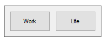

#What is this?
This is a very simple launcher to two separated app sets on startup

# How does it look?
Just headless window with two buttons

#What does it do?
When you click to one of these buttons, the launcher runs one of attached bat files.

Work.bat and life.bat respectively

# Bat files
Work.bat and life.bat should contain calls to all the applications you need.

See example inside.

#How to build
[Download and install Autoit](https://www.autoitscript.com/site/autoit/downloads/) and run "Compile Script to .exe (x64)" from Windows start panel.

Or just get exe from this repo release.

#How to run
Put it in the windows autostart any way you know how.

For example [this way](https://support.microsoft.com/en-us/windows/add-an-app-to-run-automatically-at-startup-in-windows-10-150da165-dcd9-7230-517b-cf3c295d89dd)
